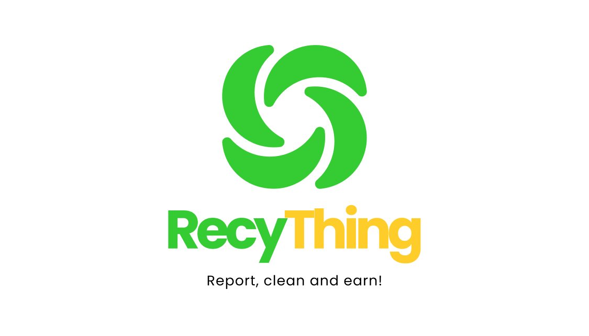

# RecyThing - Website (Admin)



## Table of Contents

- [RecyThing - Website (Admin)](#recything---website-admin)

  - [Table of Contents](#table-of-contents)
  - [Folder Structure](#folder-structure)
  - [Tech Stack](#tech-stack)
  - [Contributors](#contributors)
  - [How To Export Your Modules (Re-exporting)](#how-to-export-your-modules-re-exporting)
  - [Naming Conventions](#naming-conventions)
  - [Project Documents](#project-documents)
  - [References](#references)

## Folder Structure

Before diving into the code, it's important to understand the project's folder structure. The structure is organized to enhance readability and maintainability of the code. Here's a high-level overview of the directory layout:

```bash
src
├───apis         # Objects and methods for API calls
├───assets       # Static assets (images, etc.)
├───components   # Reusable components (buttons, sections, etc.)
├───configs      # Configuration files (Axios, Chakra UI Theme, etc.)
├───hooks        # Custom React hooks
├───layout       # Page layouts
├───pages        # Feature pages
├───routes       # Route definitions and routing logic
├───services     # Services (authentication, etc.)
├───store        # Redux store and reducers
├───utils        # Utility functions
├───App.jsx      # Main App file to render pages and routes
├───index.css    # Global styles
└───main.jsx     # Entry point of the app, providers are set up here
```

## Tech Stack

This project uses the following technologies:

[](https://axios-http.com/)
[](https://chakra-ui.com/)
[](https://www.chartjs.org/)
[](https://ckeditor.com/)
[](https://www.framer.com/api/motion/)
[](https://react-hook-form.com/)
[](https://reactrouter.com/)
[](https://reactjs.org/)
[](https://redux-toolkit.js.org/)
[](https://tailwindcss.com/)
[](https://vercel.com/)
[](https://vitejs.dev/)
[](https://github.com/jquense/yup)

> For more information about the tech stack, please refer to the [package.json](https://github.com/RecyThing/RecyThing-Web/blob/develop/package.json)

## Contributors

This project wouldn't be possible without the hard work and dedication of our team. Here are the contributors who brought this project to life:

| No  | Name            | Role        | Github Profile Link                                                      |
| :-- | :-------------- | ----------- | ------------------------------------------------------------------------ |
| 1.  | Taksa Wibawa    | Team Leader | [https://github.com/TaksaWibawa](https://github.com/TaksaWibawa)         |
| 2.  | Putri Ramadhani | Member      | [https://github.com/Putri-R](https://github.com/Putri-R)                 |
| 3.  | Felicio Angga   | Member      | [https://github.com/FelicioAngga](https://github.com/FelicioAngga)       |
| 4.  | Dady Bima       | Member      | [https://github.com/WorkerHarder171](https://github.com/WorkerHarder171) |
| 5.  | Leonardy Wijaya | Member      | [https://github.com/Leonardiwijaya](https://github.com/Leonardiwijaya)   |
| 6.  | Indra Kurniawan | Member      | [https://github.com/indrakurr](https://github.com/indrakurr)             |
| 7.  | Irfan Maulana   | Member      | [https://github.com/IrfanM66](https://github.com/IrfanM66)               |
| 8.  | Rivaldo         | Member      | [https://github.com/badebess](https://github.com/badebess)               |
| 9.  | Naufal Darma    | Member      | [https://github.com/naufalpratam4](https://github.com/naufalpratam4)     |

## How To Export Your Modules (Re-exporting)

_Why do we need to re-export our modules?_

> We need to re-export our modules so that we can import them from a single file instead of importing them from multiple files.

_How to re-export our modules?_

1. create a folder named `button` in `src/components`
2. create a file named `index.js` in `src/components/button` for re-exporting your button component
3. create a file named `YourButton.js` in `src/components/button` for your button component
4. in `src/components/button/YourButton.js`:

   > this file will act as your button component

   ```js
   import React from "react";

   export function YourButton() {
    return <button>Your Button</button>;
   }
   ```

5. in `src/components/button/index.js`:

   > this file will act as a re-exporter for your button component

   ```js
   export { YourButton } from "./YourButton";
   // or if you have multiple components in this folder
   export * from "./YourButton";
   ```

6. lastly, in `src/components/index.js`:

   > this file will act as a re-exporter for all your other components

   ```js
   export * from "./button";
   ```

7. now you can import your button component from `src/components` in any file:

   > example: we want to import our button component in `src/pages/Page.js`

   ```js
   import { YourButton } from "../components";

   export function Page() {
    return <YourButton />;
   }
   ```

8. file structure will look like this:

   ```bash
   src
   ├── components
   │   ├── button
   │   │   ├── YourButton.js # your button component
   │   │   ├── YourOtherButton.js
   │   │   ├── ...
   │   │   └── index.js # re-exporter for your button components
   │   ├── other-component
   │   │   ├── ...
   │   └── index.js # we will import our components from this file
   └── pages
       └── Page.js
   ```

## Naming Conventions

> In this project, we use [PascalCase](https://en.wikipedia.org/wiki/PascalCase) for naming our files and we use [kebab-case](https://en.wikipedia.org/wiki/Letter_case#Special_case_styles) for naming our folders.

## Project Documents

- [Figma](https://www.figma.com/file/MNMdvvfmCZVFc6HRsjrcCy/Recything-Design?type=design&node-id=1-3&mode=design&t=pimRrZcLkCqLhSpF-0)
- [Trello](https://trello.com/b/QBUvaFOh/recything-web)
- [Software Requirement Specification](https://docs.google.com/document/d/1xQdsNs_42wmlnQ73Ue3aHJNr0KqgJbSCxgM5B0stt7k/edit#heading=h.1erwhldcnuec)

## References

- [React](https://reactjs.org/): JavaScript library for building user interfaces
- [Vite](https://vitejs.dev/): Development environment and bundler
- [Chakra UI](https://chakra-ui.com/): UI component library
- [Tailwind CSS](https://tailwindcss.com/): Utility-first CSS framework
- [CKEditor](https://ckeditor.com/): Rich text editor
- [Redux Toolkit](https://redux-toolkit.js.org/): Global state management
- [React Router](https://reactrouter.com/): Declarative routing for React
- [React Hook Form](https://react-hook-form.com/): Efficient, flexible, and extensible forms
- [Yup](https://github.com/jquense/yup): Form validation
- [Axios](https://axios-http.com/): Promise-based HTTP client
- [Chart.js](https://www.chartjs.org/): Simple yet flexible JavaScript charting
- [Framer Motion](https://www.framer.com/api/motion/): Animation library for React
- [Vercel](https://vercel.com/): Deployment platform
